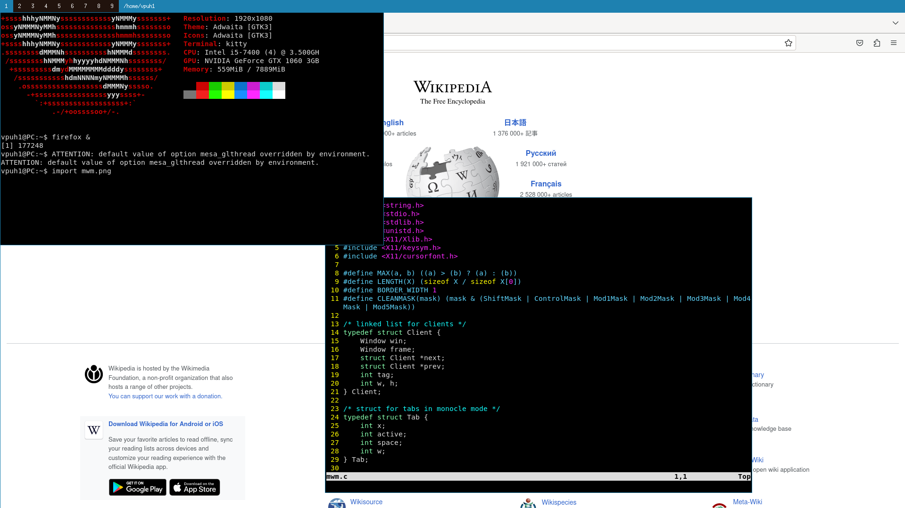

# Mwm
Minimalistic Window Manager written in C.

### Description
Mwm is a minimalistic window manger written in C. It has 9 workspaces and two stacking modes (layots): monocle and floating.
You can move windows around the workspaces and resize them.


### Installation
Clone this repo, after that:
```
make && sudo make install
```
If you are using `xinit` add following line to `~/.xinitrc`
```
exec mwm
```
then type `startx`
### Key Bindings
| key  | function  |
|---|---|
| Win + 1-9  | move to workspace 1-9 |
| Win + Shift + 1-9  | move window to workspace 1-9  |
| Win + Return  | spawn terminal (by default `kitty`)  |
| Win + Tab  | move to the next window  |
| Win + Shift + c  | close window  |
| Win + m  | choose monocle layout (i.e. tabs)  |
| Win + f  | choose floating layout (by default) |
| Win + left mouse button  | change focus, move windows around |
| Win + right mouse button  | resize window |

### Config
You can change font family, font size and default terminal in `config.h`
```C
static const char font_name[] = "monospace 10";
...
static char *cmd_term_name[]  = { "kitty", NULL };
```
